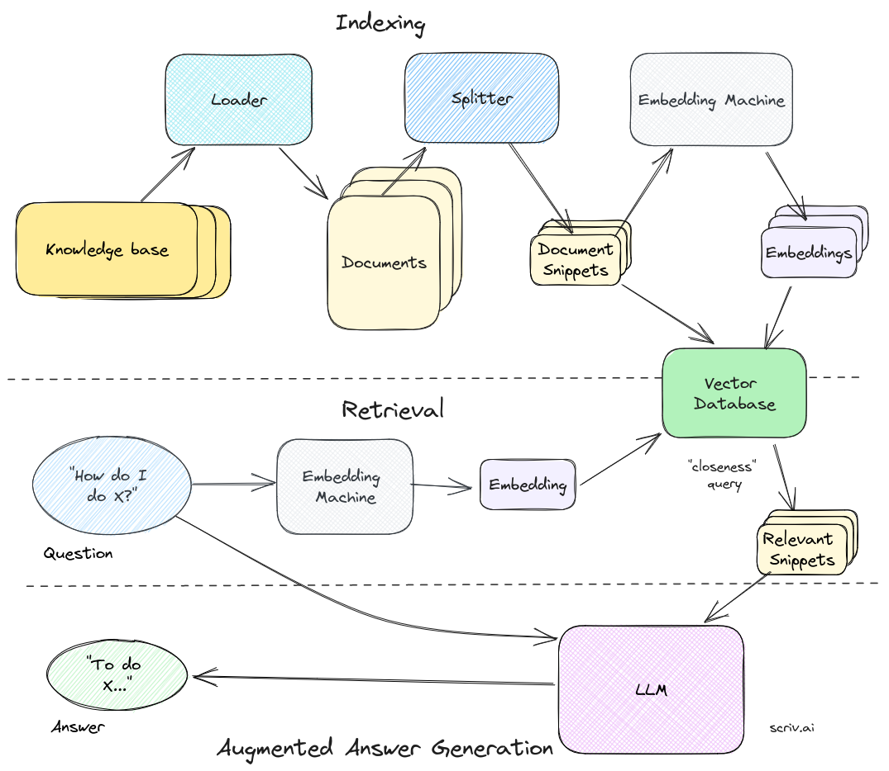

# Open-source RAG

This repository implements Retrieval Augmented Generation (RAG), a powerful technique utilizing open source Language Models (LLMs) and Embedding models. It allows users to convert documents in various formats (Image, PDF, or Text) into vectors and store them in a vector database for efficient retrieval.

## Purpose

This repository simplifies the implementation of RAG using the WhereIsAI/UAE-Large-V1 embedding model and provides multiple LLM options.

## Embedding Model and LLMs

The embedding model, WhereIsAI/UAE-Large-V1, is utilized in this project. Additionally, users can choose from the following LLM options:

- Mixtral-8x7B-v0.1-GPTQ
- openchat_3.5-GPTQ
- zephyr-7B-beta-GPTQ
- vicuna-13B-v1.5-16K-GPTQ  

Vector Database: Chromadb

Here by default openchat_3.5-GPTQ is being used. It requires atleat 6 gigs of VRAM for local inference.

For more information about the embedding model and LLMs, refer to 
[Personal Doc](https://morancium.notion.site/open-source-rag-implementation-4da61a3fb61846078c1f75753339980e?pvs=25).

...
